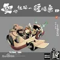

title: 四川说唱专辑序列
date: 2025-05-20 10:34:00 +0800
categories: [随笔]
tags: [生活]
pin: true
author: Bauzzy

toc: true
comments: true

typora-root-url: ../../bauzzy.github.io

math: false
mermaid: true

**专辑名称**：2005 - 2008 BIG ZOO MIXTAPE
**创作者**：老熊MOW
**时间**：2006 - 01 - 01
**厂牌**：Bigzoo
<small>说唱会馆前身，川渝说唱开山之作。主要成员有老熊MOW、FreeT(也就是现在的邓典果)、猫儿师、Ty、LilWhite，后来只有DDG和Ty还算活跃，其他人则都算是隐退或半隐退了。而且老熊和成员好像还发生过一些不愉快的事情。</small>

---

**专辑名称**：要的就是一种随意
**创作者**：谢帝
**时间**：2013 - 11 - 9
**厂牌**：说唱会馆
<small>09年的《来到团结镇》应该是谢帝发布的第一首单曲。13年发布的这张是第一章EP，尤其是收录了《明天不上班》这首歌，一炮便真正打响了川渝说唱甚至是整个嘻哈圈的招牌，谢帝的成功并不是偶然，技术扎实且谦虚而幽默，但他也是相当幸运的。</small>